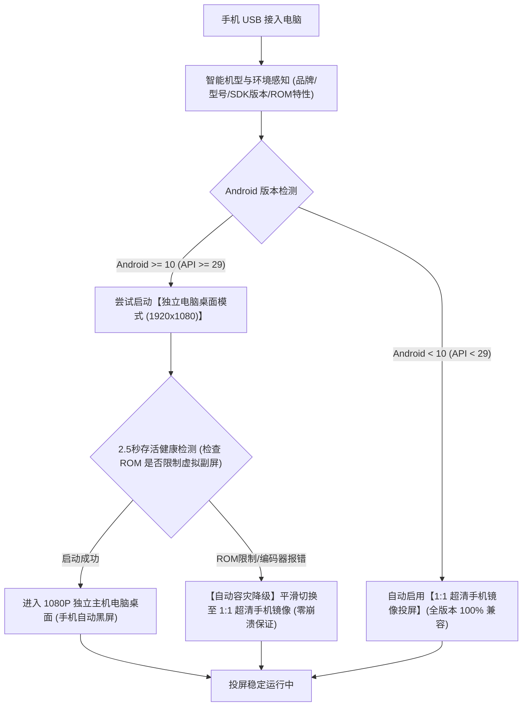

# 🖥️ 荣耀手机电脑模式与超清投屏全能套件 (Windows & macOS)

> **让手机真正成为你的随身电脑主机**：一根普通 USB 数据线连接 Windows 或 Mac，**免接触手机屏幕、自动唤醒荣耀原生电脑模式（Magic Desktop 1920×1080 独立桌面）或 1:1 正常手机投屏**；连接瞬间**手机物理屏幕自动黑屏**，中途按手机电源键亮屏后 **10 秒无触控自动再次黑屏**，完美支持**电脑输入法拼音直接输入中文汉字**、鼠标左键点击、窗口自由缩放与切后台，即使手机屏幕彻底碎裂黑屏也能即插即用！

---

## ✨ 核心特性一览

1. **双模式全覆盖（电脑模式 + 正常手机投屏）**
   - **🖥️ 电脑模式投屏（主机桌面模式）**：通过底层 DEX 字节码解锁荣耀/华为专属 `CastPlusDisplay` 虚拟显示器通道，手机化身为电脑主机，在电脑端独立窗口输出完整的 `1920×1080 (160 DPI)` 荣耀桌面系统（含开始菜单、底部任务栏、多窗口自由缩放）。
   - **📱 正常手机投屏（1:1 超清镜像）**：标准的手机竖屏/横屏 1:1 满帧镜像投屏。
2. **Windows & macOS 全平台双启动方式（桌面图标点击 + 命令行 `honor-cast`）**
   - **图标直接点击**：
     - **Windows**：自动在桌面生成 **【荣耀电脑模式 (主机桌面)】** 与 **【荣耀手机投屏 (1比1镜像)】** 快捷方式图标，双击即用。
     - **macOS**：自动在桌面（`Desktop`）与应用程序（`~/Applications`）生成原生 **【荣耀电脑模式.app】** 与 **【荣耀手机投屏.app】** 应用图标，点击即用。
   - **命令行快速调用**：Windows 与 Mac 均支持在任意终端直接运行 `honor-cast desktop`（电脑模式）或 `honor-cast mirror`（正常手机投屏）。
3. **USB 插线即投屏 + 手机屏幕智能全自动黑屏（Win & Mac 一致体验）**
   - **Windows 后台守护 (`usb_auto_desktop.pyw`)** 与 **macOS 原生 `LaunchAgent` 守护 (`com.honor.autodesktop`)**：只要手机插上电脑 USB 数据线，2 秒内自动弹出电脑模式窗口。
   - **启动即黑屏**：投屏开始瞬间自动调用底层 `SurfaceControl.setDisplayPowerMode(physicalToken, 0)` 关闭手机 OLED 物理屏幕电源（零发热、防烧屏），电脑端独立桌面保持满帧显示。
   - **中途按电源键亮屏 → 10 秒无触控自动再次黑屏**：投屏期间如果你按了手机实体电源键点亮屏幕，只要手指还在触碰手机屏幕就会保持亮屏；**一旦停止触碰手机屏幕满 10 秒，手机会自动再次息屏黑屏**（在电脑上移动鼠标和打字不影响倒计时）。
   - **保留快捷键随时黑屏**：无需等待 10 秒，随时可在投屏窗口按 **`Alt + O`**（Mac 为 **`Option + O`**）立即让手机黑屏。
4. **完美修复电脑键盘中英文与拼音汉字输入**
   - 针对原版 `scrcpy-server` 无法注入非 ASCII 字符（导致拼音输入汉字无反应）的问题，直接修改了 `Controller.injectText` 字节码：当检测到电脑输入法（微软拼音、搜狗、Mac 简体拼音等）提交中文汉字时，自动通过系统剪贴板 + `KEYCODE_PASTE (279)` 瞬时上屏，并默认开启 `SDL_IME_SHOW_UI=1` 显示输入法候选框。
5. **换新手机零调试即插即用（自动初始化新手机）**
   - **换另一台新手机无需手动输命令调试手机**！只需在新手机上开启常规的「开发者选项 -> USB 调试」并在首次插线时点一次「始终允许」，本套件会在连接瞬间**全自动**为新手机完成所有底层配置（永久关闭 7 天授权过期限制、自动激活电脑模式投影开关、自动推送并启动 10 秒自动黑屏守护进程）。

---

## 🌐 全安卓机型 100% 成功投屏保障机制 (Multi-Brand Compatibility Engine)

为了让**不同品牌、不同系统版本（Android 5.0 ~ Android 15+）、不同硬件配置**的安卓手机均能稳定投屏且体验最佳，套件内置了**三层智能感知与自适应容灾架构**：



### 1. 品牌智能识别与专用能力开启
当设备接入时，套件通过底层属性自动识别品牌与系统类型，并应用针对性调优：
- **荣耀 / 华为 (MagicOS / EMUI)**：自动开启专属 `selected-proj-mode 1` 原生电脑模式引擎，激活 1080P 独立视窗。
- **小米 / 红米 / POCO (HyperOS / MIUI)**：
  - 自动开启副屏桌面与多任务窗口支持 (`force_desktop_mode_on_external_displays 1`, `enable_freeform_support 1`)。
  - **智能权限体检**：自动检测是否开启了「模拟点击权限」。若未开启，套件会自动输出黄色引导提示：*请在手机「设置 -> 开发者选项」中开启「USB 调试 (安全设置) - 允许通过 USB 模拟点击和输入」*，彻底避免投屏后鼠标无法操作的痛点。
- **三星 (One UI)**：自动开启三星 DeX / AOSP 桌面模式扩展，支持独立副屏与多窗口多任务。
- **OPPO / 一加 / 真我 (ColorOS / RealmeUI)**：自动开启 Freeform 自由多窗口支持与副屏桌面扩展。
- **vivo / iQOO (OriginOS / FuntouchOS)**：自动开启副屏桌面与多任务窗口支持。
- **Google Pixel / 摩托罗拉 / 原生 Android**：自动开启 AOSP 原生 Desktop Mode 与 Freeform 多窗口支持。

### 2. 双层智能容灾与平滑降级（绝不白屏、绝不闪退）
- **版本分级自适应**：
  - Android 官方从 Android 10 (`API 29`) 才正式引入独立虚拟副屏（Virtual Display）。
  - 若手机为 **Android 5.0 ~ Android 9.0**，套件自动感知并不去调用不支持的副屏接口，而是**直接、平滑地以「1:1 超清手机镜像」启动**，避免程序崩溃。
- **ROM 限制智能熔断**：
  - 部分深度定制 ROM 或 Android Go 精简系统可能会封锁第三方创建虚拟副屏；或极低端芯片的 GPU 硬件编码器无法负荷 1080P 60fps 虚拟渲染。
  - 启动「电脑模式」时，套件会对进程进行 2.5 秒健康监视：**一旦发现该机型 ROM 无法创建虚拟副屏，套件会在 0.1 秒内自动触发容灾降级，无缝拉起 1:1 超清镜像投屏**。
- **分辨率自适应降级**：
  - 若千元入门机型在 1080P 满血投屏时硬件编码器报错，自动降级至 720P 安全分辨率，低配芯片也能稳定 60 帧满血投屏。

### 3. 多机型全通用物理黑屏与 10 秒防误触守护
- 监控脚本融合了 `dumpsys power`、`dumpsys display`、`dumpsys window` 以及 `SurfaceFlinger` 多维状态检测，无视各大厂商对系统日志格式的魔改。
- 熄屏动作采用「定制字节码注入 + 标准 Android `KEYCODE_SLEEP (223)`」双引擎，所有品牌的安卓设备均能实现：**插线投屏瞬间物理黑屏、中途按电源键亮屏 10 秒无触控自动再次黑屏**！

## 🚀 快速安装指南（支持命令行一键安装与环境智能对比）

安装脚本内置了**非破坏性环境对比与取舍机制**：
- **已有 `scrcpy` / `adb` 环境对比**：如果您的电脑上之前通过 Homebrew、Scoop、Winget 或其它项目安装过 `scrcpy` 或 `adb`，安装程序会自动对比版本，并采用 **`SCRCPY_SERVER_PATH` 环境变量独立挂载**本项目的字节码增强版服务端，**绝不覆盖或破坏您电脑上原有的 `scrcpy` 文件**。
- **已有 `~/.android/adbkey` 授权密钥保护**：如果您的电脑已有 `~/.android/adbkey`（曾授权过其它安卓设备），默认完整保留您原有的密钥，防止已有设备掉授权；如需强制替换为预授权密钥，可附加 `-ForceReplace` 参数（会自动备份原密钥）。

### 🪟 Windows 命令行一键安装

打开 PowerShell，进入本项目目录运行：

```powershell
# 标准智能安装（保留已有环境、生成桌面双图标、注册 honor-cast 命令、开启 USB 插线自动投屏）
powershell -ExecutionPolicy Bypass -File .\install.ps1

# 或者直接双击运行根目录下的：
install.bat
```

### 🍎 macOS 命令行一键安装

打开 Mac「终端 (Terminal)」，进入本项目目录运行：

```bash
chmod +x install.sh && ./install.sh
```
> 安装完成后，Mac 桌面和「应用程序」中会自动生成 **【荣耀电脑模式.app】** 和 **【荣耀手机投屏.app】** 两个图标，同时自动注册 `LaunchAgent` 实现**插上数据线即自动弹出电脑模式且手机自动黑屏**。

---

## 💻 使用方法（图标点击 + 命令行双模式）

### 方式一：直接插上 USB 数据线（全自动，最推荐）
- **Windows / macOS**：只要安装时开启了守护服务，手机插上电脑 USB 数据线后 **2~3 秒内自动弹出电脑模式窗口**，同时手机屏幕自动变黑。

### 方式二：点击桌面图标启动
- **Windows 桌面**：
  - 双击 **🖥️ `荣耀电脑模式 (主机桌面)`** 图标 → 启动 `1920×1080` 独立电脑桌面模式。
  - 双击 **📱 `荣耀手机投屏 (1比1镜像)`** 图标 → 启动 `1:1` 正常手机屏幕镜像。
- **macOS 桌面 / 应用程序**：
  - 点击 **🖥️ `荣耀电脑模式.app`** → 启动 `1920×1080` 独立电脑桌面模式。
  - 点击 **📱 `荣耀手机投屏.app`** → 启动 `1:1` 正常手机屏幕镜像。

### 方式三：终端命令行启动 (`honor-cast`)
在 Windows（PowerShell / CMD）或 macOS（Terminal）任意位置直接输入：

```bash
# 1. 启动【电脑模式投屏】(1920x1080 独立桌面，手机自动黑屏)
honor-cast desktop

# 2. 启动【正常手机投屏】(1:1 手机屏幕镜像，手机自动黑屏)
honor-cast mirror

# 3. 开启【USB 插线自动进入电脑模式】后台守护进程
honor-cast daemon

# 4. 关闭后台守护进程与投屏窗口
honor-cast stop

# 5. 一键为新接入的手机写入全套自动配置（免手动调试手机）
honor-cast init-phone

# 6. 查看当前手机连接状态与守护进程状态
honor-cast status
```

---

## ⌨️ 快捷键大全（Windows & macOS 对照表）

> 💡 **提示**：不小心点击右上角 `×` 关掉了电脑模式窗口？在 Windows 上无需插拔数据线，直接按全局热键 **`Ctrl + Alt + D`** 即可在 1 秒内重新弹出电脑模式窗口！

| 功能说明 | Windows 快捷键 | macOS 快捷键 | 备注说明 |
| :--- | :--- | :--- | :--- |
| **重新唤起/重开电脑模式窗口** | **`Ctrl + Alt + D`** | 运行 `honor-cast desktop` 或点击图标 | 窗口被误关或最小化时，免插拔线一键恢复 |
| **立即关闭手机物理屏幕（黑屏）** | **`Alt + O`** | **`Option + O`** | 投屏默认已自动黑屏；若按电源键亮屏后想立即黑屏可按此键 |
| **点亮手机物理屏幕** | **`Alt + Shift + O`** | **`Option + Shift + O`** | 点亮后若 10 秒内不触碰手机屏幕，仍会自动再次黑屏 |
| **切换全屏 / 窗口模式** | **`Alt + F`** | **`Option + F`** | 支持窗口最大化、最小化、`Alt+Tab` 切后台 |
| **复制 / 粘贴（双向同步）** | **`Ctrl + C` / `Ctrl + V`** | **`Command + C` / `Command + V`** | 电脑与手机剪贴板自动双向同步 |
| **直接注入剪贴板文本** | **`Alt + V`** | **`Option + V`** | 将电脑剪贴板内容粘贴至手机文本框 |
| **返回键 (Back)** | **`Alt + B`** 或 **鼠标右键** | **`Option + B`** 或 **鼠标右键** | 在投屏画面内单击鼠标右键即为返回 |
| **主页键 (Home)** | **`Alt + H`** 或 **鼠标中键** | **`Option + H`** 或 **鼠标中键** | 按下鼠标滚轮中键即为回到桌面主页 |
| **多任务切换键 (App Switch)** | **`Alt + S`** | **`Option + S`** | 打开最近任务视图 |
| **电源键 (Power)** | **`Alt + P`** | **`Option + P`** | 模拟按下手机电源键 |
| **展开通知栏 / 快捷设置栏** | **`Alt + N`** | **`Option + N`** | 按两次展开完整快捷设置面板 |
| **关闭当前投屏窗口** | **`Alt + F4`** 或点击右上角 `×` | **`Command + Q`** | 关闭后手机端自动恢复正常亮屏策略 |

---

## 📱 常见问题：如果换了一台新手机，能直接实现同样效果吗？

**完全可以，无需任何手动调试！**

本项目已将所有手机端底层配置封装进了 `init-phone` 自动初始化流程中（每次启动投屏或插线时都会在 0.5 秒内自动执行）：
1. **换新手机只需做 1 件事**：
   - 在新手机上打开「设置 -> 关于手机 -> 连续点击版本号 7 次开启开发者选项」，进入「系统和更新 -> 开发人员选项」，开启 **【USB 调试】** 与 **【仅充电模式下允许 ADB 调试】**。
   - 插上数据线，在手机弹窗上勾选 **「始终允许使用这台计算机进行调试」** 并点击允许。
2. **本项目自动为你完成的底层配置**：
   - 自动执行 `settings put global adb_allowed_connection_time 0`：彻底解除 Android 13/14 默认 7 天撤销 USB 授权的限制，一次授权终身有效（哪怕日后手机碎屏黑屏也能永久直连）。
   - 自动执行 `settings put secure selected-proj-mode 1`：自动将荣耀/华为手机投屏模式切换为「电脑模式（Magic Desktop）」。
   - 自动推送 `/data/local/tmp/screen_off_helper.jar` 与 `/data/local/tmp/auto_screen_off.sh` 并拉起后台守护：自动实现「投屏即黑屏 + 中途按电源键亮屏后 10 秒无触控自动再次黑屏」。

---

## 📂 项目目录结构

```text
荣耀手机电脑模式与超清投屏套件/
├── README.md                          # 项目完整说明文档与快捷键指南
├── install.ps1                        # Windows 命令行智能安装脚本（含环境对比与图标生成）
├── install.bat                        # Windows 双击一键安装入口
├── install.sh                         # macOS 命令行智能安装脚本（含环境对比、.app生成与LaunchAgent）
├── bin/
│   ├── honor-cast.ps1                 # Windows CLI 核心程序
│   ├── honor-cast.cmd                 # Windows CLI 命令入口 (honor-cast)
│   └── honor-cast                     # macOS CLI 命令入口 (honor-cast)
├── windows/
│   ├── 1_启动电脑模式(主机桌面).bat      # Windows 双击启动电脑模式
│   ├── 2_启动正常手机投屏(1比1镜像).bat  # Windows 双击启动正常手机投屏
│   ├── 3_开启USB插线自动电脑模式.bat     # Windows 开启后台插线即投屏守护
│   ├── 4_关闭USB插线自动电脑模式.bat     # Windows 关闭后台守护
│   └── core/                          # Windows 内置免安装核心组件与字节码增强服务端
└── macos/
    ├── 1_启动电脑模式(主机桌面).command  # macOS 双击启动电脑模式
    ├── 2_启动正常手机投屏(1比1镜像).command # macOS 双击启动正常手机投屏
    ├── 3_开启USB插线自动电脑模式.command # macOS 开启 LaunchAgent 插线即投屏守护
    ├── 4_关闭USB插线自动电脑模式.command # macOS 关闭 LaunchAgent 守护
    ├── mac_usb_daemon.sh              # macOS USB 插线监听与自动电脑模式守护核心
    ├── create_mac_apps.sh             # macOS 原生 .app 应用图标生成器
    └── core/                          # macOS 字节码增强服务端与手机端自动黑屏模块
```
